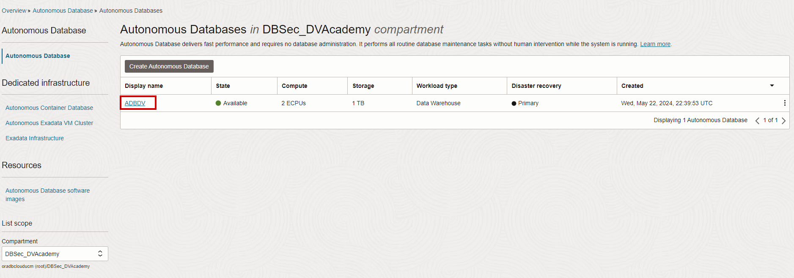
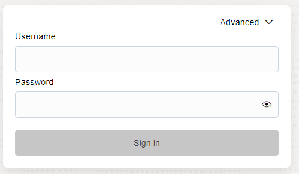
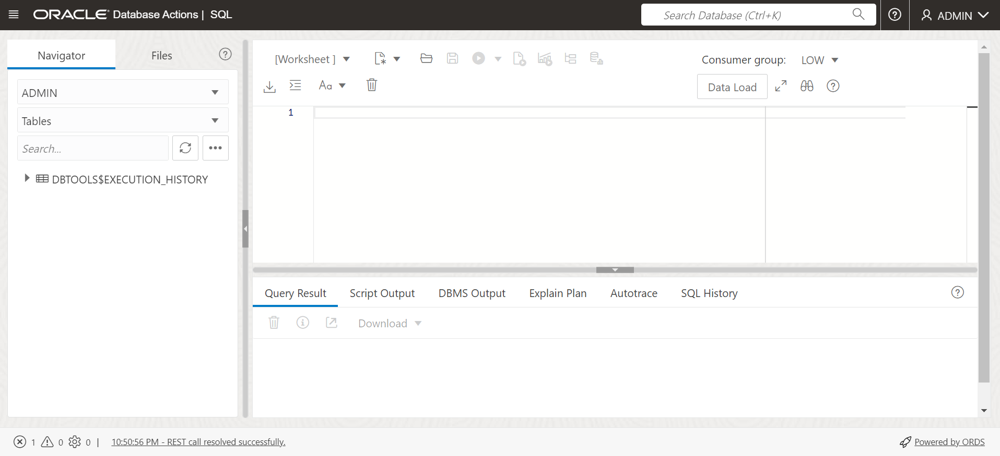
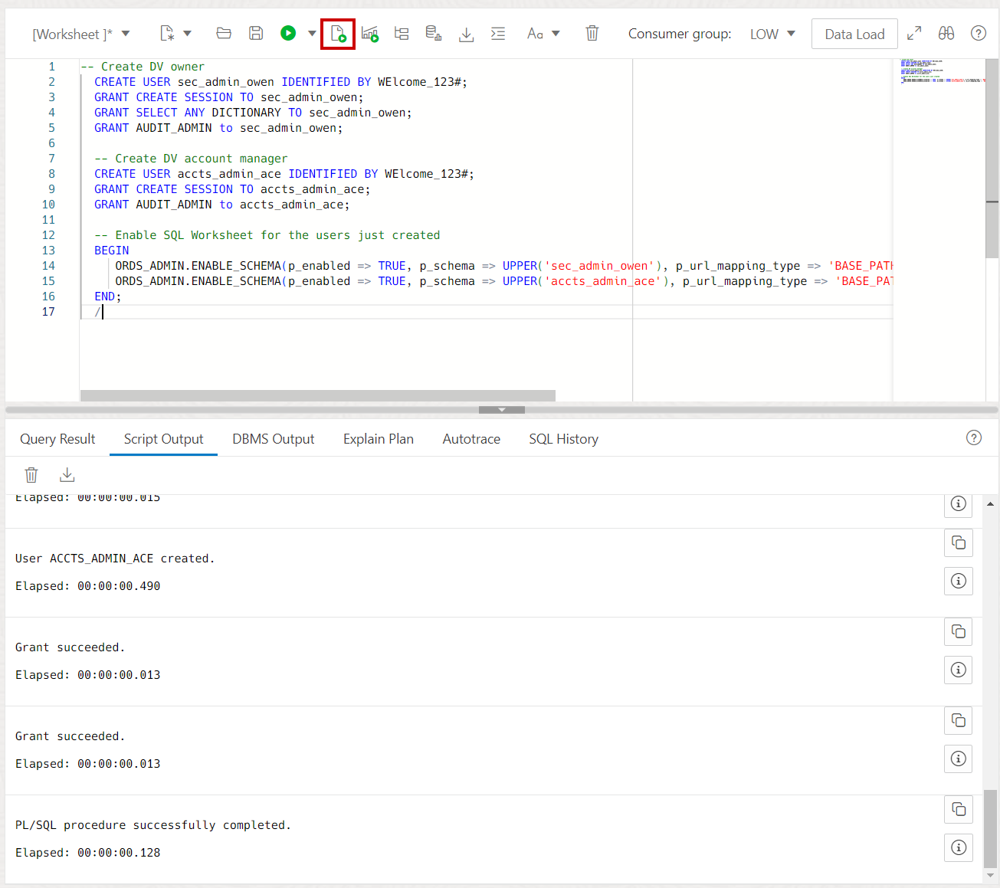
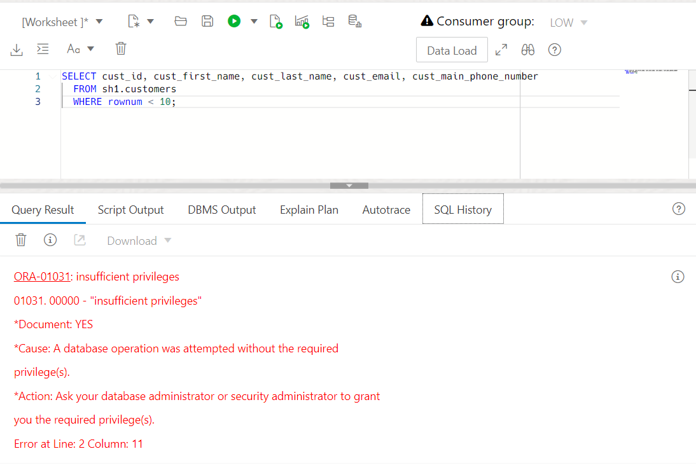
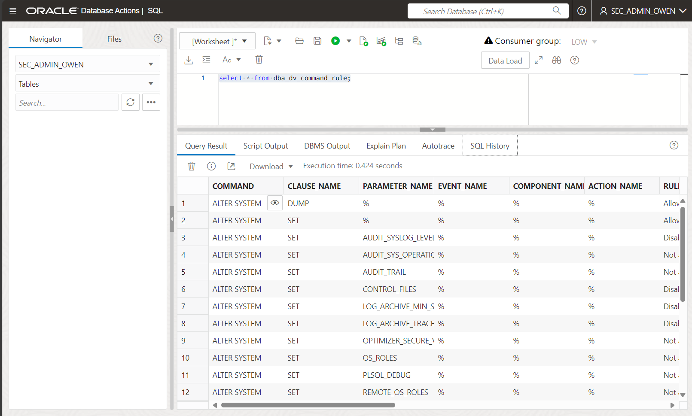
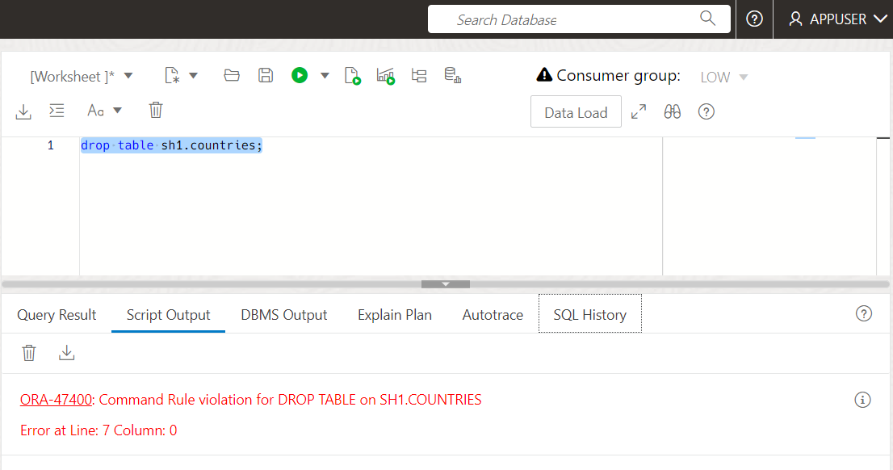
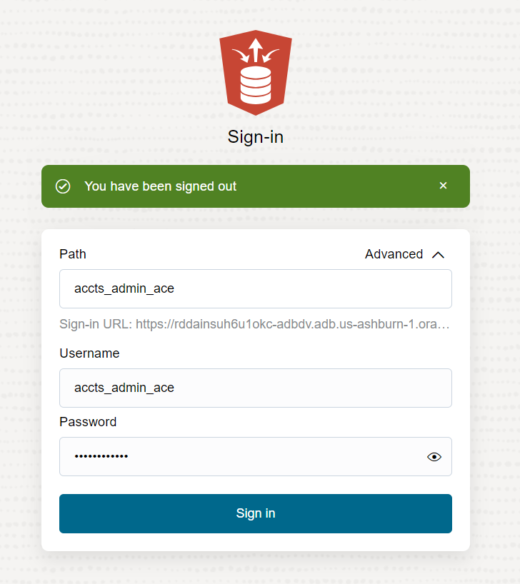
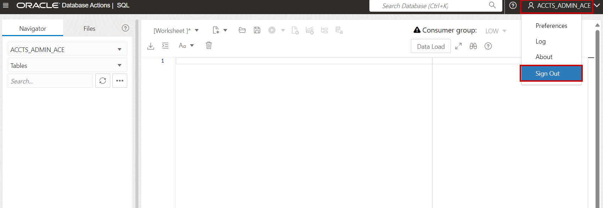
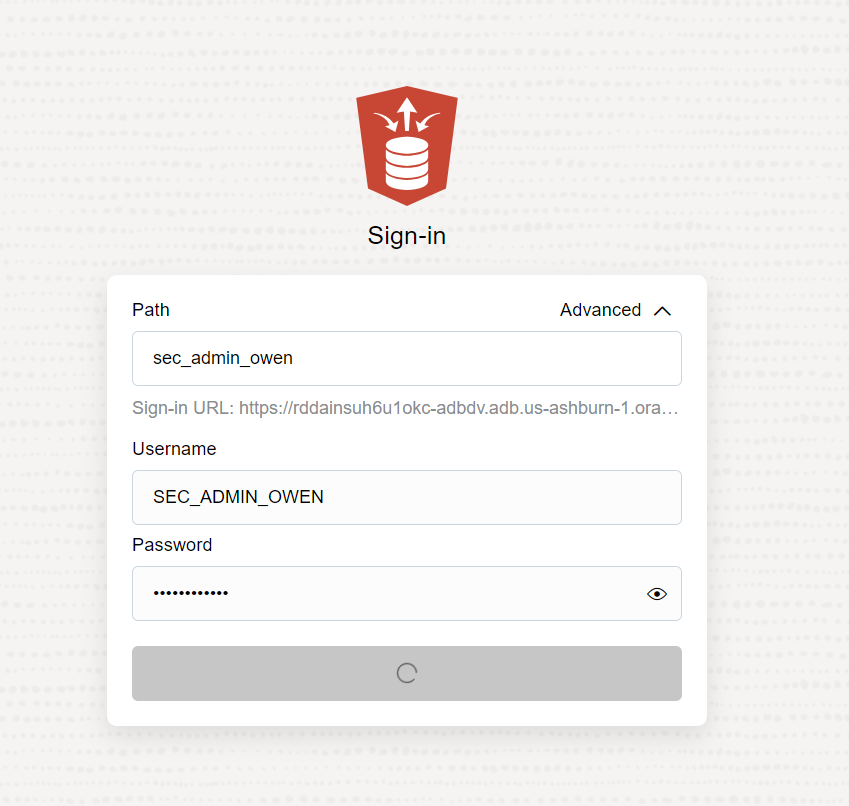

# Oracle Database Vault on an Autonomous Database

## Introduction
This workshop will introduce you to the various features and functionality of Oracle Database Vault (DV). You will learn how to configure these features in an Autonomous Database to prevent unauthorized privileged users from accessing sensitive data.

No matter whether it's on-premises, in a managed data center, or the cloud, any type of managed database services run the risk of 'admin snooping', allowing privileged users - and especially compromised privileged user accounts - access to sensitive data. Oracle Autonomous Database with Database Vault provides powerful security controls, restricting access to application data from privileged database users, reducing the risk of internal and external threats and addressing common compliance requirements.

You can deploy controls to block privileged account access to application data and control sensitive operations inside the database. Trusted paths can be used to add additional security controls to authorized data access and database changes. IP addresses, usernames, client program names and other factors can be used as part of Oracle Database Vault security controls to increase security. **Oracle Database Vault secures existing database environments transparently, eliminating costly and time consuming application changes.**

While customers are concerned with threat actors, the most common threat to application data is human error. Mistakes happen for many reasons, including tight deadlines, fatigue, or confusing connections to production for connections to non-production systems. Regardless of the reason, Oracle Database Vault can help you minimize mistakes by allowing you to disable destructive commands such as `DROP TABLE`, `TRUNCATE TABLE`, `DROP INDEX` and many more. 

*Estimated Time:* 75 minutes

*Version tested in this lab:* Oracle Autonomous Database 19c

### Video Preview

Watch a preview of "*LiveLabs - Prevent unauthorized data access in Autonomous Databases with Database Vault (May 2022)*" [](youtube:xKq0a_dwM1Y)

<!--Watch the video below for a quick walk-through of the lab.
[Oracle Database Vault on Oracle Autonomous Database](videohub:1_hpawkio9)-->

### Objectives

Oracle Database vault comes pre-installed with your Oracle Autonomous Database.

In this lab you will:
- Enable Database Vault in an Oracle Autonomous Database
- Protect sensitive data using a Database Vault realm
- Reduce mistakes on production data with Database Vault command rules
- Create an audit policy to capture realm and command rule violations
- Test your controls before implementation with Database Vault simulation mode

You will use the `SH1` schema containing multiple tables such as `CUSTOMERS` or `COUNTRIES` tables which contain sensitive information and need to be protected from privileged users such as the schema owner (`SH1` and DBA (`DBA_DEBRA`). But the data in these tables should be available to the application user (`APPUSER`).

   

**Note:**
- **In this workshop, the Configure/Enable/Disable DV command syntax is only for Autonomous Database Shared.**
- Other Oracle Database deployments, including Oracle Autonomous Database Dedicated, Exadata Cloud Service, Database Base Services, and on-premises database, use a slightly different syntax.

### Prerequisites
This lab assumes you have:
- A Free Tier, Paid or LiveLabs Oracle Cloud account
- You have completed "Prepare Your Environment" step previously


### Lab Timing (estimated)

| Task No. | Feature | Approx. Time |
|---|------------------------------------------------------------|-------------|
| 1 | Configure and enable Database Vault | <5 minutes |
| 2 | Demonstrate Separation of Duties (SoD) | <5 minutes |
| 3 | Create a simple realm to protect application data | 10 minutes |
| 4 | Reduce mistakes by blocking destructive commands | 10 minutes |
| 5 | Create unified audit policies to capture Database Vault violations | 10 minutes |
| 6 | Test your controls with simulation mode | 10 minutes |
| 7 | Disable Database Vault | <5 minutes |

## Task 1: Configure and enable Database Vault

You start by creating two DV user accounts:

- **Database Vault owner (`SEC_ADMIN_OWEN`)**
    - This user is mandatory as an owner of DV objects.
    - `SEC_ADMIN_OWEN` has the `DV_OWNER` role which can enable or disable Database Vault, and manage policies, and `DV_ADMIN` role, which can configure Database Vault policies but not enable or disable Database Vault.
    - Oracle recommends you create additional accounts with either the `DV_ADMIN` role for day-to-day use. You should securely store the account created as `DV_OWNER` and only use it when necessary. 
- **Database Vault account manager (`ACCTS_ADMIN_ACE`)**
    - This user is an optional but recommended to separate responsibilities between users. 
    - `ACCTS_ADMIN_ACE` has the `DV_ACCTMGR` role and can create users, change user passwords, drop users, and manage user profiles. 

Database Vault tips: 
- While DV owner can also become DV account manager, Oracle recommends maintaining separation of duties by using two different accounts
- By default `ADMIN` has `DV_OWNER`, `DV_ADMIN`, `DV_ACCTMGR` and several other significant DV-related roles. Oracle recommends you do not use the `ADMIN` account except when absolutely necessary. You should grant the appropriate roles, such as `DV_ADMIN` or `DV_ACCTMGR` to named database users (e.g. jsmith, kjohnson) to minimize sharing of accounts.
- Create at least one additional database account for each of the above users (`SEC_ADMIN_OWEN` and `ACCTS_ADMIN_ACE`) and give each user one of the roles (`DV_OWNER` or `DV_ACCTMGR`) and grant it `WITH ADMIN OPTION` so they can grant or revoke the role from other users. These are your backup accounts. Never lose your primary or backup accounts. 
- You can store the passwords to the users you create during the initial configuration in a pasword vault, or other secure service, and require named accounts (e.g. jsmith, kjohnson) for day-to-day operations.

1. If you are not already in your Oracle Autonomous Databse, open a SQL Worksheet on your Autonomous DB as the `ADMIN` database user
    
      - In Oracle Cloud Infrastructure (OCI), select your `ADBDV` database created during the "Prepare Your Environment" step

      

      - In your `ADBDV` database's details page, click the `Database Actions` then click `SQL` to navigate to the SQL Worksheet page. 

      

      - You should be signed in automatically. If you are not, and you receive a screen like the following, enter your `ADMIN` username and password. 

         ````
         <copy>ADMIN</copy>
         ````

         ````
         <copy>WElcome_123#</copy>
         ````

         

      - Once you have logged into `Database Actions | SQL` you should see a worksheet similar to the following.

      
    
2. Create the Database Vault owner and account manager users

      ````
      <copy>
      -- Create DV owner
      CREATE USER sec_admin_owen IDENTIFIED BY WElcome_123#;
      GRANT CREATE SESSION TO sec_admin_owen;
      GRANT SELECT ANY DICTIONARY TO sec_admin_owen;
      GRANT AUDIT_ADMIN to sec_admin_owen;

      -- Create DV account manager
      CREATE USER accts_admin_ace IDENTIFIED BY WElcome_123#;
      GRANT CREATE SESSION TO accts_admin_ace;
      GRANT AUDIT_ADMIN to accts_admin_ace;

      -- Enable SQL Worksheet for the users just created
      BEGIN
         ORDS_ADMIN.ENABLE_SCHEMA(p_enabled => TRUE, p_schema => UPPER('sec_admin_owen'), p_url_mapping_type => 'BASE_PATH', p_url_mapping_pattern => LOWER('sec_admin_owen'), p_auto_rest_auth => TRUE);
         ORDS_ADMIN.ENABLE_SCHEMA(p_enabled => TRUE, p_schema => UPPER('accts_admin_ace'), p_url_mapping_type => 'BASE_PATH', p_url_mapping_pattern => LOWER('accts_admin_ace'), p_auto_rest_auth => TRUE);
      END;
      /
      </copy>
      ````

    **Note:**
       - Copy/Paste the following SQL queries into SQL Worksheet
       - Press [**F5**] or click the "Run Scripts" icon
       - Check the **Script Output** frame to maek sure there are no errors. 

       

3. Configure the Database Vault with the database user accounts you just created.  You should see **PL/SQL procedure successfully completed.**

      ````
      <copy>EXEC DBMS_CLOUD_MACADM.CONFIGURE_DATABASE_VAULT('sec_admin_owen', 'accts_admin_ace');</copy>
      ````

4. Verify that Database Vault is configured but not yet enabled. Oracle Database Vault will be enabled in the next 2 steps.

      ````
      <copy>SELECT * FROM DBA_DV_STATUS;</copy>
      ````

   

    **Note:** `DV_CONFIGURE_STATUS` must be **TRUE**

5. Now, enable Database Vault. You should see **PL/SQL procedure successfully completed.**

      ````
      <copy>EXEC DBMS_CLOUD_MACADM.ENABLE_DATABASE_VAULT;</copy>
      ````
    
6. You must **restart** the database to complete the Database Vault enablement. 

    - From the Autonomous Database details page, click **More Actions**, select **Restart**, and **confirm** the restart. 

       

    - Once restart completes, go back to the SQL Worksheet as the `ADMIN` user and verify DV is enabled.

         ````
         <copy>SELECT * FROM DBA_DV_STATUS;</copy>
         ````

         

      **Note:** `DV_ENABLE_STATUS` should be `TRUE`

7. You have successfully configured and enabled Database Vault on Oracle Autonomous Database. 

## Task 2: Demonstrate Separation of Duties (SoD)

In Oracle Autonomous Database, the `ADMIN` user has all privileges, including the privileges required to administer Database Vault security policies. In real life, you may wish to separate security administration, user administration, and database administration into different accounts. From now you will use a DBA account instead of `ADMIN` user because in production that's what you must do.

In the "Prepare your environment" step you created the user `DBA_DEBRA`. This user has the `DBA` role on the Autonomous DB

1. To demonstrate the effects of the DB Vault separtion of duties (SoD) on a DBA account, open the SQL Worksheet as the `DBA_DEBRA` user. 

   - To do this, it is easiest to press the name `ADMIN` in the top right of the browser

       

   - You will see a screen similar to the following image. You must click **Advanced** to expand the **Path** in order to provide `DBA_DEBRA` as the path and the **Username**

       

      Path (this must be lowercase): 
      ````
      <copy>dba_debra</copy>
      ````

      Username:
      ````
      <copy>dba_debra</copy>
      ````

      Password:
      ````
      <copy>WElcome_123#</copy>
      ````

   - You may need to choose the **SQL worksheet** option. Click the **Development** tab then **SQL** on the left side. 

       


2. View `DBA_DEBRA`'s roles. 

   Notice that `DBA_DEBRA` has several roles, including `PDB_DBA` (the DBA role in an Oracle Autonomous Database) but no DV-related roles.

      ````
      <copy>SELECT * FROM session_roles ORDER BY 1;</copy>
      ````
     

       

3. Create a test user `DEMO1`. 

   Notice that `DBA_DEBRA` is not able to create a user, despite having the `DBA` role. This is **because Database Vault is enabled** and Debra does not have the `DV_ACCTMGR` role. 

      ````
      <copy>CREATE USER demo1;</copy>
      ````

      ````
      ORA-01031: insufficient privileges
      ````

               
4. Let's try altering the user `APPUSER`. 

   Again, because Database Vault enforces separation of duties, Debra cannot change passwords without the `DV_ACCTMGR` role. If this is Debra's responsibility, you can grant her, or another user, the role to manage users or manage user profiles. 

      ````
      <copy>ALTER USER appuser IDENTIFIED BY WElcome_123456#;</copy>
      ````

      ````
      ORA-01031: insufficient privileges
      ````         
      
6. As you continue with the lab, you will use `SEC_ADMIN_OWEN` and `ACCTS_ADMIN_ACE` for all Database Vault actions. The duties of database administration (`DBA_DEBRA`) are now separate from the duties of user administration (`ACCTS_ADMIN_ACE`) and Database Vault administration (`SEC_ADMIN_OWEN`)

   **Note:** If you would like `DBA_DEBRA` to have the ability to manage user accounts and user profiles, you can perform `GRANT DV_ACCTMGR TO DBA_DEBRA` and she will be able to perform account management tasks again. Oracle Database Vault gives you the flexibility to decide which users should use these highly-critical user management privileges and which ones should not. 

You have completed this task. You have a basic understanding of how Oracle Database Vault implements separation of duties and helps you use it to meet industry or regulatory controls. 

## Task 3: Create a Simple Realm

Next, you will create a Database Vault realm to secure the `SH1.CUSTOMERS` table from access by `DBA_DEBRA`, `ADMIN`, and other privileged users. You can even prevent the table owner, `SH1`, from accessing the table and only allow the `APPUSER` to access `CUSTOMERS`. This task will demonstrate why this might be useful. 

A Database Vault realm is a protected zone inside the database where database schemas, objects, and roles can be secured. For example, you can secure a set of schemas, objects, and roles that are related to accounting, sales, or human resources. After you have secured these into a realm, you can use the realm to control the use of system and object privileges by specific accounts or roles. This enables you to enforce context-sensitive access controls for anyone who wants to use these schemas, objects, and roles.

1. To demonstrate the effects of this realm, it is important to execute the same SQL query from these 3 users before and after creating the realm:
    - To proceed, **open SQL Worksheet in 3 web-browser pages** connected with a different user (`DBA_DEBRA`, `SH1` and `APPUSER`) as shown in Task 1 previously
   
       **Note:** only one SQL Worksheet session can be open in a standard browser window at the same time, hence **open each of your sessions in a new web-browser window (Mozilla, Chrome, Edge, Safari, etc.) as well as "incognito" or "private" browing mode.**
   
   - As reminder, the password of these users is the same.
    
      ````
      <copy>WElcome_123#</copy>
      ````

   - Copy/Paste and execute the following query

      ````
      <copy>SELECT cust_id, cust_first_name, cust_last_name, cust_email, cust_main_phone_number
      FROM sh1.customers
      WHERE rownum < 10;
      </copy>
      ````
 
       **Note:** These 3 users can see the `SH1.CUSTOMERS` table because:
      
      - `SH1` because `SH1` owns the table and has an implicit ability to query it's own tables.
         - Path (must be lowercase): 

            ````
            <copy>sh1</copy>
            ````

         - Username: 

            ````
            <copy>SH1</copy>
            ````

         - Password: 

            ````
            <copy>WElcome_123#</copy>
            ````
      - `DBA_DEBRA` because it has the `PDB_DBA` role, which allows it query tables in `SH1` or any other schema. 

         - Path (must be lowercase): 

            ````
            <copy>dba_debra</copy>
            ````

         - Username: 

            ````
            <copy>DBA_DEBRA</copy>
            ````

         - Password: 

            ````
            <copy>WElcome_123#</copy>
            ````
      
      - `APPUSER` because it have the `READ ANY TABLE` system privilege, which allows it query tables in `SH1` or any other schema. 

         - Path (must be lowercase): 

            ````
            <copy>appuser</copy>
            ````

         - Username: 

            ````
            <copy>APPUSER</copy>
            ````

         - Password: 

            ````
            <copy>WElcome_123#</copy>
            ````


2. Now, let's create a realm to secure `SH1` tables by executing this query below as the `SEC_ADMIN_OWEN` user. You will **open a 4th web-browser window** to login as the following:

      - Path (must be lowercase): 

         ````
         <copy>sec_admin_owen</copy>
         ````

      - Username: 

         ````
         <copy>SEC_ADMIN_OWEN</copy>
         ````

      - Password: 

         ````
         <copy>WElcome_123#</copy>
         ````

         ````
         <copy>
         -- Create the "PROTECT_SH1" DV realm
            BEGIN
               DVSYS.DBMS_MACADM.CREATE_REALM(
                  realm_name => 'PROTECT_SH1'
                  ,description => 'A mandatory realm to protect SH1 tables'
                  ,enabled => DBMS_MACUTL.G_YES
                  ,audit_options => DBMS_MACUTL.G_REALM_AUDIT_FAIL
                  ,realm_type => 1); 
            END;
            /

         -- Show the current DV realm
         SELECT name, description, enabled FROM dba_dv_realm WHERE id# >= 5000 ORDER BY 1;
         </copy>
         ````

         
 
    **Note:** A quick explanation of a realm is:
       - A realm is a collection of objects to be protected the same way. 
       - The Database Vault realm you created is enabled and is a mandatory realm. 
       - The difference between a **mandatory** and **regular** realm: 
         - Regular realms block system privileges but allows direct object grant. The user **does not** have to be a member of realm authorization list. 
         - Mandatory realms block direct object grants (even by the object owner) in addition to system privileges. The user **must** have the privileges **and** be a member of the realm authorization list. 

3. Add objects to the realm to protect (here, the `CUSTOMERS` table)

      ````
      <copy>
      -- Set SH1 objects as protected by the DV realm "PROTECT_SH1"
         BEGIN
             DVSYS.DBMS_MACADM.ADD_OBJECT_TO_REALM(
                 realm_name   => 'PROTECT_SH1',
                 object_owner => 'SH1',
                 object_name  => 'CUSTOMERS',
                 object_type  => 'TABLE');
         END;
         /

      -- Show the objects protected by the DV realm PROTECT_SH1
      SELECT realm_name, owner, object_name, object_type
        FROM dvsys.dba_dv_realm_object
       WHERE realm_name IN (SELECT name FROM dvsys.dv$realm WHERE id# >= 5000);
      </copy>
      ````

   

       **Note:** Now the table `CUSTOMERS` is protected and no one can access on it becuase there are no members of the realm authorization list yet. Even the table owner, `SH1`, cannot access the table. 

4. Check the effect of this realm
   
      - Execute again the following query in SQL Worksheet of each the 3 users:
         - `DBA_DEBRA`
         - `SH1`
         - `APPUSER`

         ````
         <copy>
            SELECT cust_id, cust_first_name, cust_last_name, cust_email, cust_main_phone_number
            FROM sh1.customers
            WHERE rownum < 10;
         </copy>
         ````
 
      - Each user should receive the following output. 

         


       - **Objects in the realm cannot be accessed by any database users**, including the DBA (`DBA_DEBRA`) and the schema owner (`SH1`). Remember, this is because there are no realm authorized members yet. 

5. Now, go back to SQL Worksheet as the `SEC_ADMIN_OWEN` user and make sure you have an authorized application user (`APPUSER`) in the realm by executing this query

      ````
      <copy>
      -- Grant access to APPUSER only for the DV realm "PROTECT_SH1"
         BEGIN
             DVSYS.DBMS_MACADM.ADD_AUTH_TO_REALM(
                 realm_name   => 'PROTECT_SH1',
                 grantee      => 'APPUSER');
         END;
         /
      </copy>
      ````

   

6. Re-execute the SQL query to show that only `APPUSER` now can read the data

      ````
      <copy>
         SELECT cust_id, cust_first_name, cust_last_name, cust_email, cust_main_phone_number
           FROM sh1.customers
          WHERE rownum < 10;
      </copy>
      ````
 
       - as user `DBA_DEBRA`

          

       - as user `SH1`

          

       - as user `APPUSER`

          

       - `APPUSER` must be the only user who has access to the table from now!**

## Task 4: Reduce mistakes by blocking destructive commands	

You can reduce the possibility of mistakes on production databases by disabling destructive commands. Examples of destrutive commands include, but are not limited to:

- `DROP TABLE`
- `DROP INDEX`
- `ALTER TABLE`
- `ALTER INDEX`
- `TRUNCATE TABLE`

Some of these commands may need to be used occasionally and, when necessary, the command rules can be disabled, switched to simulation mode, or a rule set can be created to allow very specific use-cases to enable the commands. 

In this task, you will create a command rule to `Disable` the `DROP TABLE` command. This will allow `APPUSER` to perform every operations, using it's system privileges on the `SH1` schema, **except** for `DROP TABLE` commands


1. Open a SQL Worksheet as the `SEC_ADMIN_OWEN` user. 
    
      ````
      <copy>WElcome_123#</copy>
      ````

2. First, query the existing command rules. You will see several command rules created by default. These command rules help protect database and Database Vault related objects.  Review the command rules to understand the concept. 

      ````
      <copy>select * from dba_dv_command_rule;</copy>
      ````

   

3. Next, create a Database Vault command rule that will block `DROP TABLE` on the `SH1` schema. You should see **PL/SQL procedure successfully completed.**

   **Note:** You will use a default rule set, *Disabled*, to disable the command for every database user. This is essentially like adding `WHERE 1=0` to a SQL query to return zero rows as 1 can never equal 0. 

      ````
      <copy>
      BEGIN
          DBMS_MACADM.CREATE_COMMAND_RULE(
             command 	 => 'DROP TABLE',
             rule_set_name   => 'Disabled',
             object_name       => 'COUNTRIES',
             object_owner       => 'SH1',
             enabled         => DBMS_MACUTL.G_YES);
      END;
      /
      </copy>
      ````

4. Now, query only the Database Vault command rules that are not in your database by default. 

      ````
      <copy>select * from dba_dv_command_rule where oracle_supplied != 'YES';</copy>
      ````

   

5. Using your other browser windows, attempt to drop the `SH1.COUNTRIES` table. 

   - All three users shoul should recieve a **Command Rule violation** error message:

      - `SH1`
      - `DBA_DEBRA`
      - `APPUSER`

      ````
      <copy>drop table sh1.countries;</copy>
      ````
      
      

You have completed this task. You can now see how you can use Oracle Database Vault to mitigate the mistakes made in a production database. You could disable destructive commands, like `DROP TABLE`, like you did in this lab or you could create a Database Vault rule set that contains different logic.  For example, changes could be allowed only if the attempt meets one, or more, of the following criteria: 

   - Weekends
   - Outside of business hours
   - Database connection from a jump, bastion, or other trusted system. 
   - Two-person integrity: two database users are both logged in at the same time in order for a change to be allowed
   - A database role is granted and enabled

These are but a few of the scenarios you can implement with the flexability available in Oracle Database Vault. 

## Task 5: Create an Audit Policy to Capture Realm Violations

You may also want to capture an audit trail of unauthorized access attempts to your realm objects. Since the Autonomous Database includes Unified Auditing, you will create a policy to audit database vault activities

1. You will need to authenticate as `ACCTS_ADMIN_ACE` by logging out of a session in an existing window and authenticating as ACE. 

   

   Path (this must be in lowercase):  
      ````
      <copy>accts_admin_ace</copy>
      ````
   Username: 
      ````
      <copy>ACCTS_ADMIN_ACE</copy>
      ````
   Password:
      ````
      <copy>WElcome_123#</copy>
      ````

   

   - Select **SQL** and press **Open**. 

   

2. Check that no audit trail log exists. The query should return zero rows or say **mo data found**. 

      ````
      <copy>
      -- Display the audit trail log
      SELECT os_username, dbusername, event_timestamp, action_name, sql_text 
        FROM unified_audit_trail
       WHERE DV_ACTION_NAME='Realm Violation Audit' order by 3;
      </copy>
      ````
3. Create an audit policy on the DV realm `PROTECT_SH1` created earlier in the lab. Once created, the audit policy must be enabled. 

      ````
      <copy>
      -- Create the Audit Policy
         CREATE AUDIT POLICY dv_realm_sh1
            ACTIONS COMPONENT=DV Realm Violation ON "PROTECT_SH1";

      -- Enable the Audit Policy
         AUDIT POLICY dv_realm_sh1;
      </copy>
      ````

   

4. As earlier in the lab, you will return the queries on `SH1.CUSTOMERS` and view the audit records. 

    - To proceed, **re-execute the same SQL query in 3 different SQL Worksheet opened in 3 web-browser window** connected with a different user (`DBA_DEBRA`, `SH1` and `APPUSER`)
   
       **Note:**
          -  Attention, only one SQL Worksheet session can be open in a standard browser window at the same time, hence **open each of your sessions in a new web-browser window (Mozilla, Chrome, Edge, Safari, etc) or by using the "Incognito mode"!**
          - As a reminder, the password of these users is the same.
    
             ````
             <copy>WElcome_123#</copy>
             ````

    - Copy and paste then run the following query

         ````
         <copy>
            SELECT cust_id, cust_first_name, cust_last_name, cust_email, cust_main_phone_number
            FROM sh1.customers
            WHERE rownum < 10;
         </copy>
         ````
 
       - as user `DBA_DEBRA`

       

       - as user `SH1`

       

       - as user `APPUSER`

       

       - `DBA_DEBRA` and `SH1` users cannot access the `SH1.CUSTOMERS` table and should generate an audit record of their failed attempt to violate policy. 

5. Go back to the SQL Worksheet as the `ACCTS_ADMIN_ACE` user to review realm violation audit trail 

      ````
      <copy>
      -- Display the audit trail log
      SELECT os_username, dbusername, event_timestamp, action_name, sql_text 
        FROM unified_audit_trail
       WHERE DV_ACTION_NAME='Realm Violation Audit' order by 3;
      </copy>
      ````

   

    **Note:** You should see the `DBA_DEBRA` and `SH1` failed attempts. If you review the values in the `SQL_TEXT` column, you will notice it is not the exact query you submited in your **SQL worksheet**. This is due to how **Database Actions** processes query. Look closer and you will see it embedded as a nested table. 

## Task 6: Simulation Mode

You might be thinking, "I do not know enough about the application to feel comfortable implementing Database Vault realms or command rules." 

To minimize the impact you might have on your application, You can use Oracle Database Vault simulation mode to simulate the enforcement of realms and command rules.

In this task, you will use simulation mode to identify the database users, hosts, programs, and modules used to access objects in the `SH1` schema, particularly the `COUNTRIES` table. 

1. You will once again log out of `ACCTS_ADMIN_ACE` and log in as `SEC_ADMIN_OWEN`. This is because Owen has the `DV_OWNER` role, allowing him to create and modify Database Vault policies. 
    
   

   Path (this must be in lowercase):  
      ````
      <copy>sec_admin_owen</copy>
      ````
   Username: 
      ````
      <copy>SEC_ADMIN_OWEN</copy>
      ````
   Password:
      ````
      <copy>WElcome_123#</copy>
      ````

   

   - Select **SQL** and press **Open**. 

   

2. First, query the simulation log to show that it has no current values

      ````
      <copy>
         SELECT violation_type, username, machine, object_owner, object_name, command, dv$_module
         FROM dba_dv_simulation_log;
      </copy>
      ````

   

3. Next, update the Database Vault realm from `ENABLED` to `SIMULATION` mode. This will allow any user, with the apprporiate system or object privileges. to query realm protected objects. Only violators will be logged in the simulation log. 

      ````
      <copy>BEGIN
      DVSYS.DBMS_MACADM.UPDATE_REALM(
         realm_name => 'PROTECT_SH1'
         ,description => 'A mandatory realm to protect SH1 tables'
         ,enabled => DBMS_MACUTL.G_SIMULATION
         ,audit_options => DBMS_MACUTL.G_REALM_AUDIT_FAIL
         ,realm_type => 1); 
      END;
      /</copy>
      ````

4. Perform a query similar to task 2. 

    - To proceed, **re-execute the same SQL query in 3 different SQL Worksheet opened in 3 web-browser pages** connected with a different user (`DBA_DEBRA`, `SH1` and `APPUSER`)
   
       **Note:**
          -  Attention, only one SQL Worksheet session can be open in a standard browser window at the same time, hence **open each of your sessions in a new web-browser window (Mozilla, Chrome, Edge, Safari, etc) or by using the "Incognito mode"!**
          - As a reminder, the password of these users is the same.
    
             ````
             <copy>WElcome_123#</copy>
             ````

    - Copy and paste then run a query against `SH1.CUSTOMERS` using the three users:
         - `APPUSER`
         - `DBA_DEBRA`
         - `SH1`

         ````
         <copy>
            SELECT * FROM sh1.customers WHERE rownum < 20;
         </copy>
         ````
   
         

         - All three users can access the `SH1.CUSTOMERS` table becuase the realm is in simulation mode, not enforcement mode. 
      
5. Now, go back to the SQL Worksheet as the `SEC_ADMIN_OWEN` user to see what new entries you have. Remember you created a command rule to simulate blocking user select!

      ````
      <copy>
         SELECT violation_type, username, machine, object_owner, object_name, command, dv$_module
         FROM dba_dv_simulation_log;
      </copy>
      ````

   

    **Note:**
      - Only two out of three users who performed the query will show up in the violations log becuase the third user, `APPUSER`, is a realm authorized member. 
         - `APPUSER` is not violating the realm by performing the query. 
      - The violation log shows where they connected from and what client they used to connect

6. Before moving to the next lab, you will clean out the simulation log table. As `SEC_ADMIN_OWEN`, run the following commands. 

      ````
      <copy>
      -- Purge simulation logs
      DELETE FROM DVSYS.SIMULATION_LOG$;

      -- Current simulation logs after purging
      SELECT count(*) FROM dba_dv_simulation_log;
      </copy>
      ````
## Task 7: Disable Database Vault

1. As `SEC_ADMIN_OWEN`, drop the realm and command rule you created. 

      ````
      <copy>
      -- Drop the "PROTECT_SH1" DV realm
      BEGIN
          DVSYS.DBMS_MACADM.DELETE_REALM_CASCADE(realm_name => 'PROTECT_SH1');
      END;
      /

      -- There should be no rows returned
      SELECT name, description, enabled FROM dba_dv_realm WHERE oracle_supplied != 'YES';

      -- Delete the command rule protecting DROP TABLE on SH1.COUNTRIES
      BEGIN
          DBMS_MACADM.DELETE_COMMAND_RULE(
             command 	   => 'DROP TABLE',
             object_name   => 'COUNTRIES',
             object_owner  => 'SH1');
      END;
      /
      
      -- There should be no rows returned
      SELECT * FROM dba_dv_command_rule WHERE oracle_supplied != 'YES';
      </copy>
      ````

2. Now, disable Oracle Database Vault on your Oracle Autonomous Database. This command should return **PL/SQL procedure successfully completed.**

      ````
      <copy>EXEC DBMS_CLOUD_MACADM.DISABLE_DATABASE_VAULT;</copy>
      ````
  
3. You must restart the database to complete the Database Vault enabling process. Restart the database from the console by selecting "**Restart**" in "More Actions" drop-list as shown here. 

       

4. Once restart completes, log in to SQL Worksheet as the `DBA_DEBRA` user and verify DV is shows the `DV_ENABLE_STATUS` as `FALSE`. 

      ````
      <copy>SELECT * FROM DBA_DV_STATUS;</copy>
      ````

       

5. Now, drop the Database Vault owner and account manager users

      ````
      <copy>
      DROP USER sec_admin_owen;
      DROP USER accts_admin_ace;
      </copy>
      ````

       

    **Note:** Because DB Vaut is disabled, SoD is also automatically disabled and you can now drop users with `DBA_DEBRA` user

5. Database Vault is disabled and the accounts have been dropped. If you want to, you can drop the users you created for this lab. You will need to perform this action as a privileged user, such as `ADMIN`. 

      ````
      <copy>
      DROP USER dba_debra cascade;
      DROP USER sh1 cascade;
      DROP USER appuser cascade;
      </copy>
      ````

You may now proceed to the next lab!

## **Appendix**: About the Product
### **Overview**
Oracle Database Vault provides controls to prevent unauthorized privileged users from accessing sensitive data. It also prevents unauthorized database changes.

The Oracle Database Vault security controls protect application data from unauthorized access, and help you comply with privacy and regulatory requirements.

   

You can deploy controls to block privileged account access to application data and control sensitive operations inside the database with Database Vault.

Through the analysis of privileges and roles, you can increase the security of existing applications by using least-privilege best practices.

Oracle Database Vault secures existing database environments transparently, eliminating costly and time-consuming application changes.

Oracle Database Vault enables you to create a set of components to manage security for your database instance.

These components are:

- **Realms**

A realm is a protection zone inside the database where database schemas, objects, and roles can be secured. For example, you can secure a set of schemas, objects, and roles that are related to accounting, sales, or human resources.
After you have secured these into a realm, you can use the realm to control the use of system and object privileges to specific accounts or roles. This enables you to provide context-aware access controls for anyone who wants to use these schemas, objects, and roles.

- **Command rules**

A command rule is a special security policy that you can create to control under which conditions users can execute almost any SQL statement, including SELECT, ALTER SYSTEM, database definition language (DDL), and data manipulation language (DML) statements.
Command rules work with rule sets to determine whether the statement is allowed.

- **Factors**

A factor is a named variable or attribute, such as a user location, database IP address, or session user, which Oracle Database Vault can recognize and use to make access control decisions.
You use factors in rules to control activities such as authorizing database accounts to connect to the database or the execution of a specific database command to restrict the visibility and manageability of data.
Each factor can have one or more identities. An identity is the actual value of a factor.
A factor can have several identities depending on the factor retrieval method or its identity mapping logic.

- **Rule**

The rule within a rule set is a PL/SQL expression that evaluates to true or false. You can have the same rule in multiple rule sets.

- **Rule sets**

A rule set is a collection of one or more rules that you can associate with a realm authorization, command rule, factor assignment, or secure application role. The rule set evaluates to true or false based on the evaluation of each rule it contains and the evaluation type (All True or Any True).

- **Secure application roles**

A Database Vault secure application role is a special Oracle Database role that can be enabled based on the evaluation of an Oracle Database Vault rule set.

Oracle Database Vault provides a set of PL/SQL interfaces and packages that let you configure these components.
In general, the first step you take is to create a realm composed of the database schemas or database objects that you want to secure.
You can further secure your database by creating rules, rule sets, command rules, factors, identities, and secure application roles.
In addition, you can run reports on the activities these components monitor and protect.

### **Benefits of using Database Vault**
- Addresses compliance regulations to minimize access to data
- Protects data against misused or compromised privileged user accounts
- Design and enforce flexible security policies for your database
- Addresses Database consolidation and cloud environments concerns to reduce cost and reduce exposure sensitive application data by those without a true need-to-know
- Protect access to your sensitive data by creating a trusted path (see more by performing the [Full Database Vault lab](https://apexapps.oracle.com/pls/apex/dbpm/r/livelabs/view-workshop?wid=682&clear=180&session=4531599220675))

## Want to Learn More?
Technical Documentation:
  - [Oracle Database Vault 19c](https://docs.oracle.com/en/database/oracle/oracle-database/19/dvadm/introduction-to-oracle-database-vault.html#GUID-0C8AF1B2-6CE9-4408-BFB3-7B2C7F9E7284)

Video:
  - *Understanding Oracle Database Vault (March 2019)* [](youtube:oVidZw7yWIQ)
  - *Oracle Database Vault - Use Cases (Part1) (October 2019)* [](youtube:aW9YQT5IRmA)
  - *Oracle Database Vault - Use Cases (Part2) (November 2019)* [](youtube:hh-cX-ubCkY)
  - *Oracle Database Vault Introduction (May 2021)* [](youtube:vSVr7avZ4Hg)
  - *Oracle Database Vault on ADB - Quick walk through of the Livelabs* [](youtube:O_Hi2-vZ-zU)

## Acknowledgements
- **Author** - Richard C. Evans, Database Security PM
- **Contributors** - Hakim Loumi, Alan Williams
- **Last Updated By/Date** - Richard C. Evans, Database Security PM - May 2024
