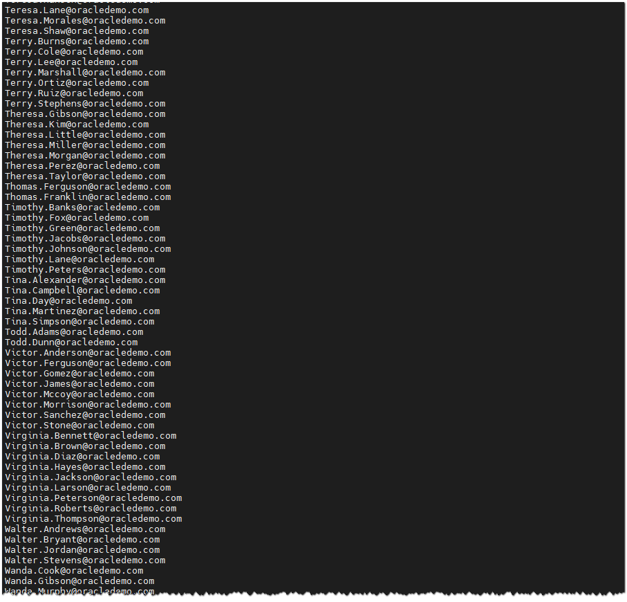
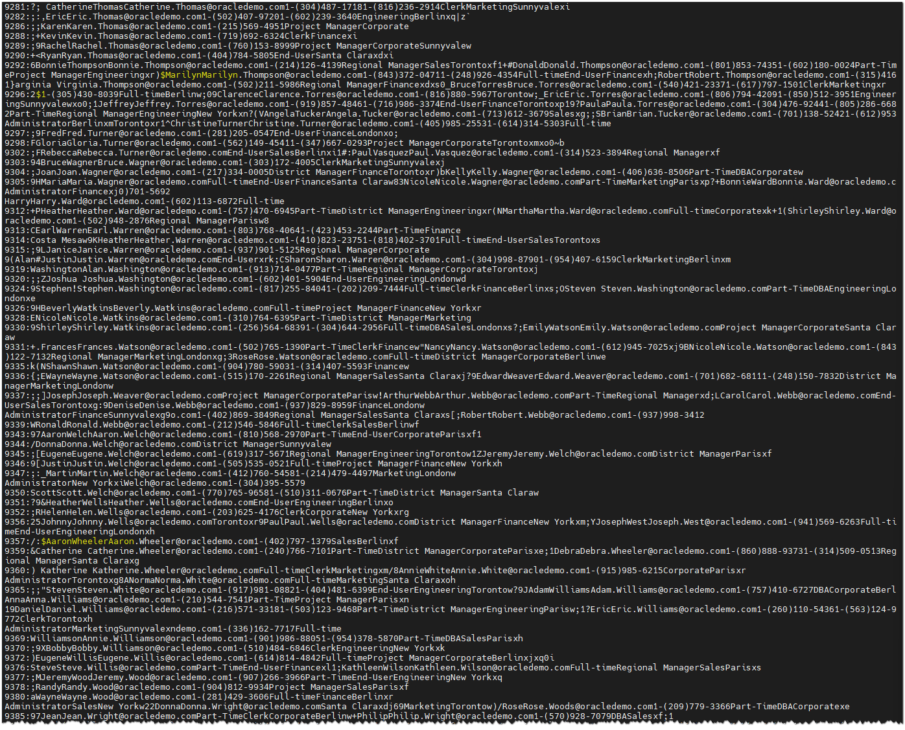
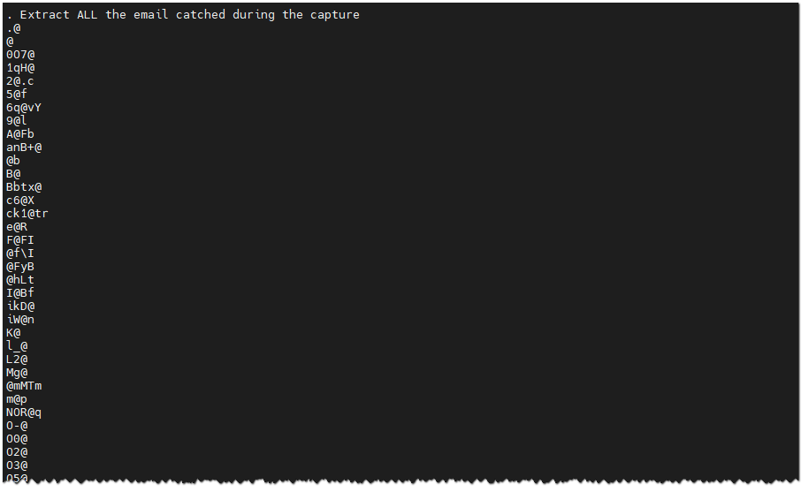

# Oracle Native Network Encryption (NNE)

## Introduction
This workshop introduces the functionality of Oracle Native Network Encryption (NNE). It gives the user an opportunity to learn how to configure this feature to encrypt and secure its data in-motion.

*Estimated Lab Time:* 15 minutes

*Version tested in this lab:* Oracle DB 19.17

### Video Preview
Watch a preview of "*LiveLabs - Oracle Native Network Encryption (May 2022)*" [](youtube:N6Uz-pVTkaI)

### Objectives
- Enable/Disable the Native Network Encryption on your database
- Check the network encryption effects before/after enabling

### Prerequisites
This lab assumes you have:
- A Free Tier, Paid or LiveLabs Oracle Cloud account
- You have completed:
    - Lab: Prepare Setup (*Free-tier* and *Paid Tenants* only)
    - Lab: Environment Setup
    - Lab: Initialize Environment

### Lab Timing (estimated)
| Step No. | Feature | Approx. Time |
|--|------------------------------------------------------------|-------------|
| 1 | Check the current network configuration | <5 minutes |
| 2 | Generate and capture SQL traffic | 5 minutes |
| 3 | Enable the network encryption | 5 minutes |
| 4 | (Optional) Disable the network encryption | <5 minutes |

## Task 1: Check the current network configuration

1. Open a Terminal session on your **DBSec-Lab** VM as OS user *oracle*

    ````
    <copy>sudo su - oracle</copy>
    ````

    **Note**: If you are using a remote desktop session, double-click on the *Terminal* icon on the desktop to launch a session

2. Go to the scripts directory

    ````
    <copy>cd $DBSEC_LABS/nne</copy>
    ````

3. View your **SQL*Net.ora** file content

    ````
    <copy>./nne_view_sqlnet_ora.sh</copy>
    ````

    **Note**: It should be empty!

   

4. Check if the network is already encrypted

    ````
    <copy>./nne_is_sess_encrypt.sh</copy>
    ````

    

    **Note**: You should not see the "Encryption service adapter" row

## Task 2: Generate and capture SQL traffic

1. Run **tcpdump** on the traffic to analyze the packets in transit on the network (wait for the end of the execution)

    ````
    <copy>./nne_tcpdump_traffic.sh</copy>
    ````

    

    

    **Note**:
    - We execute a query on the `DEMO_HR_EMPLOYEES` table
    - The output has been saved to **`tcpdump.pcap`** file
    - There are a lot of tools available to analyze pcap files

2. Now, extract sensitive data from tcpdump.pcap file, just generated, to see if the fishing was good

    ````
    <copy>./nne_tcpdump_extract.sh</copy>
    ````

    

    **Note**:
    - We extract all rows containing an email or something similar
    - Because the network is in the clear text, the `DEMO_HR_EMPLOYEES` table data is totally readable!

3. Next, run **tcpflow** to capture traffic across the wire for the Glassfish application

    - Begin the capture script and **DON'T CLOSE IT!**

        ````
        <copy>./nne_tcpflow_traffic.sh</copy>
        ````

        

        **Notes:** We will extract all lines containing an email or something similar (see the egrep command)

    - In parallel, open a web browser window to *`https://dbsec-lab:8080/hr_prod_pdb1`* to access to your Glassfish App
    
        **Notes:** If you are not using the remote desktop you can also access this page by going to *`https://<YOUR_DBSEC-LAB_VM_PUBLIC_IP>:8080/hr_prod_pdb1`*

    - Perform the following steps:

        - Login to the HR Application as *`hradmin`* with the password "*`Oracle123`*"

            ````
            <copy>hradmin</copy>
            ````

            ````
            <copy>Oracle123</copy>
            ````

            
            

        - Click on **Search Employees**

            

        - Click [**Search**]

            

    - Now go back to your terminal session to see traffic content

        

4. When you have seen the un-encrypted data, use "*`[Ctrl]+C`* " to stop the script

    **Notes:** Because the network is in the clear text, we can access to all sensitive data in transit!


## Task 3: Enable the network encryption
You will enable SQL\*Net encryption with the *`REQUESTED`* value for *`SQLNET.ENCRYPTION_SERVER`*

1. To begin with, we use this option because it will allow non-encrypted connections to still connect. While this rarely has an impact, it is often important to do this so the change does not interfere with production systems that cannot encrypt between the client and the database!

    ````
    <copy>./nne_enable_requested.sh</copy>
    ````

    

    **Note**: There's an alternative to Native Network Encryption, it's TLS certificates but those require user management and more configuration

2. Now, re-run the script to check if the session is encrypted

    ````
    <copy>./nne_is_sess_encrypt.sh</copy>
    ````

    

    **Note**: You should notice an additional line that says "**AES256 Encryption service adapter for Linux**"

3. Now, re-run **tcpdump** on the traffic to analyze the packets in transit on the network (wait for the end of the execution)

    ````
    <copy>./nne_tcpdump_traffic.sh</copy>
    ````

    

    

4. Like previously, extract the same sensitive data from the new tcpdump.pcap file generated

    ````
    <copy>./nne_tcpdump_extract.sh</copy>
    ````

    

    **Note**:
    - We extract all rows containing an email or something similar
    - Because the session is encrypted, the `DEMO_HR_EMPLOYEES` table data is unreadable!

5. Now, let's do the test with **tcpflow** for Glassfish application to see the impact of the network encryption

    - On your terminal session capture the traffic generated and, again, **DON'T CLOSE IT!**

        ````
        <copy>./nne_tcpflow_traffic.sh</copy>
        ````

        

    - Go back to your web browser, **logout** the Glassfish application and **login** again as *`hradmin`* to see what happens when we sniff this traffic

        

        

    - Click on **Search Employees**

        

    - Click [**Search**]

        

    - Now go back to your terminal session to see traffic content

        

    **Note**:
    - You should see no data!
    - We are still trying to extract all rows containing an email or something similar, but because the network is encrypted, we have nothing!
    - The data is encrypted between our Glassfish application (JDBC Thin Client) and the database
    - This works immediately (or after a refresh) because our Glassfish application creates a new connection for each query
    - A real application would probably need to be stopped and restarted to disconnect the existing application connections from the database!

6. When you have seen the effect of the network encryption, use "*`[Ctrl]+C`* " to stop the script


## Task 4: (Optional) Disable the network encryption

1. When you have completed the lab, you can return the Native Network Encryption to the default settings

    ````
    <copy>./nne_disable.sh</copy>
    ````

    

You may now proceed to the next lab!

## **Appendix**: About the Product
### **Overview**

Oracle Database provides native **data network encryption and integrity** to ensure that data in-motion is secure as it travels across the network.


The purpose of a secure cryptosystem is to convert plaintext data into unintelligible ciphertext based on a key, in such a way that it is very hard (computationally infeasible) to convert ciphertext back into its corresponding plaintext without knowledge of the correct key.

In a symmetric cryptosystem, the same key is used both for encryption and decryption of the same data. Oracle Database provides the **Advanced Encryption Standard (AES) symmetric cryptosystem** for protecting the confidentiality of Oracle Net Services traffic.

Oracle SQL*Net traffic can be encrypted by using:
- Native Network Encryption
- TLS certificate-based encryption

## Want to Learn More?
Technical Documentation:
- [Oracle Native Network Encryption 19c](https://docs.oracle.com/en/database/oracle/oracle-database/19/dbseg/configuring-network-data-encryption-and-integrity.html)

## Acknowledgements
- **Author** - Hakim Loumi, Database Security PM
- **Contributors** - Richard Evans, Rene Fontcha
- **Last Updated By/Date** - Hakim Loumi, Database Security PM - December 2022
