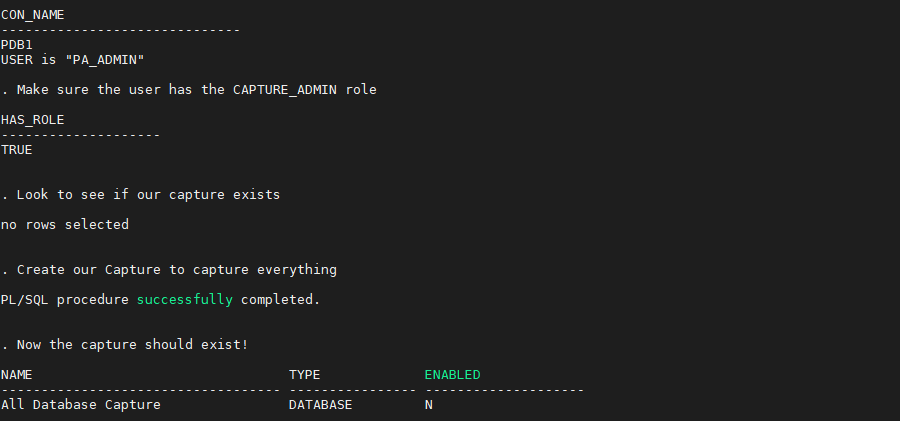
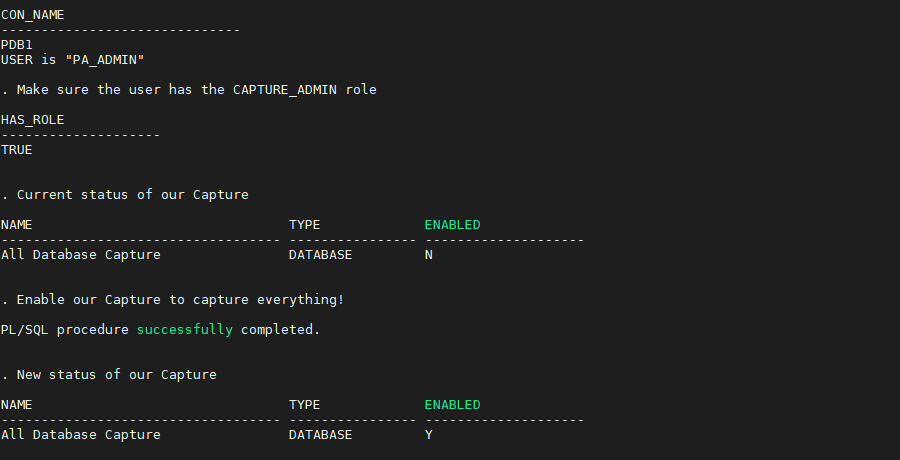
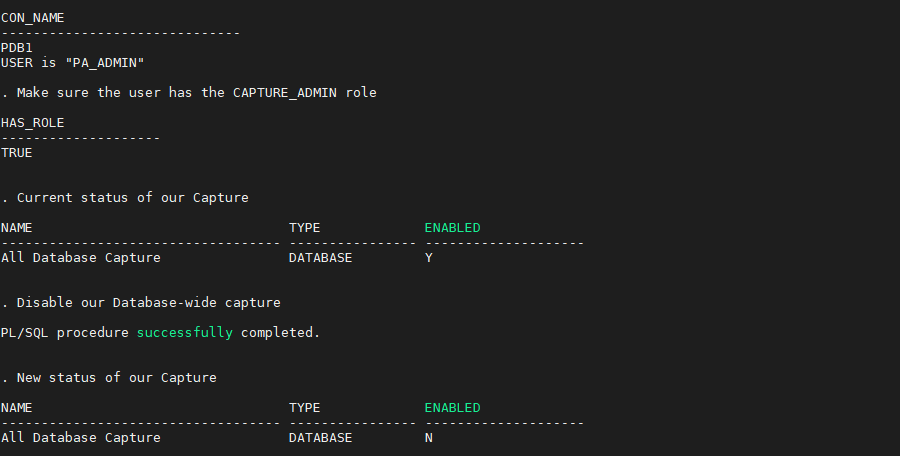
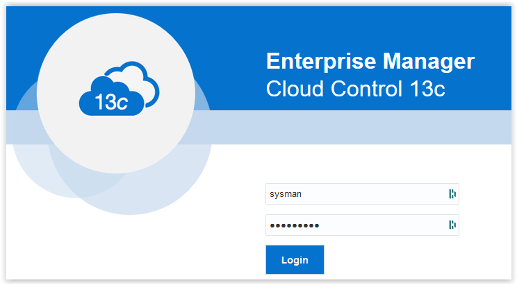
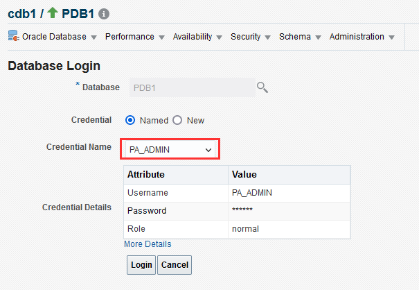
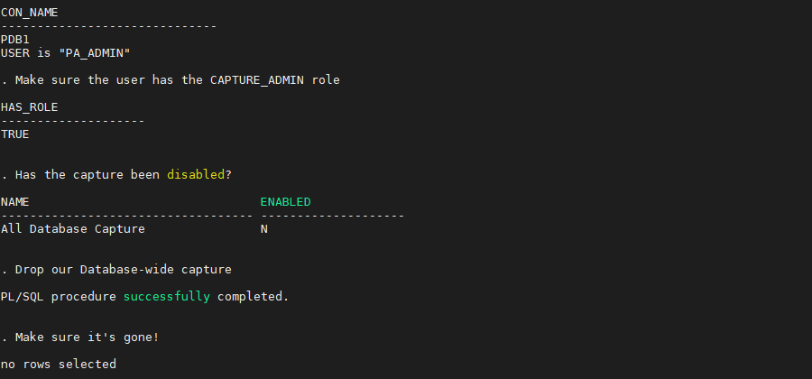

# Oracle Privilege Analysis

## Introduction
This workshop introduces the functionality of Oracle Privilege Analysis. It gives the user an opportunity to learn how to use this feature to always know privileges usage accessed by all users during all the database life.

*Estimated Lab Time:* 15 minutes

*Version tested in this lab:* Oracle DBEE 19.21

### Video Preview
Watch a preview of "*LiveLabs - Oracle Privilege Analysis (May 2022)*" [](youtube:OsvxpBIKoOQ)

### Objectives
- Capture the workload of a database
- Generate a Privilege Analysis report to know all the user/system privileges used during this capture

### Prerequisites
This lab assumes you have:
- A Free Tier, Paid or LiveLabs Oracle Cloud account
- You have completed:
    - Lab: Prepare Setup (*Free-tier* and *Paid Tenants* only)
    - Lab: Environment Setup
    - Lab: Initialize Environment

### Lab Timing (estimated)
| Step No. | Feature | Approx. Time |
|--|------------------------------------------------------------|-------------|
| 1 | Capture the workloard to analyze | 5 minutes |
| 2 | Analyze the workload caputred | 5 minutes |
| 3 | Drop the capture | <5 minutes |

## Task 1: Capture the workload to analyze

1. Open a Terminal session on your **DBSec-Lab** VM as OS user *oracle*

    ````
    <copy>sudo su - oracle</copy>
    ````

    **Note**: If you are using a remote desktop session, double-click on the *Terminal* icon on the desktop to launch a session

2. Go to the scripts directory

    ````
    <copy>cd $DBSEC_LABS/priv-analysis</copy>
    ````

3. Start by ensuring the user has the "`CAPTURE_ADMIN`" role and creating the Privilege Analysis capture

    ````
    <copy>./pa_create_capture.sh</copy>
    ````

    

4. Next, start the capture

    ````
    <copy>./pa_enable_capture.sh</copy>
    ````

    

    **Note**: This will start collecting all of the privileges and/or roles that are being used

5. Generate some workload so we have used and unused roles and privileges

    ````
    <copy>./pa_generate_workload.sh</copy>
    ````

    

6. We can disable the capture when we feel we have enough data

    ````
    <copy>./pa_disable_capture.sh</copy>
    ````

    

## Task 2: Analyze the workload captured

1.  Generating the report

    ````
    <copy>./pa_generate_report.sh</copy>
    ````

    

    **Note**:
    - It takes all of the privileges and roles that were identified as used during the capture and compares it to the roles and privileges granted to each user
    - It may take a few minutes to generate depending on the volume to be processed

2. Next, view the report results by querying the views associated with the capture output

    ````
    <copy>./pa_review_report.sh</copy>
    ````

    

    **Note**:
    - You can see all the privileges (System and Objects) used and unused by all the active users during the capture
    - This step is essential to better understand what happened on your database during this period in order to determine if your users are using their own privileges correctly or if you need to revoke some non-essential ones to avoid any risk of abuse, especially during an identity theft
    - Note that you can run this Privilege Analysis task as many times as necessary... in fact, **it is strongly recommended to do it as often as possible** to always stay in control of your users' activity rights and avoid any privilege elevation attempt by potential attackers

3. Now, open the DB Admin Console (OEM Cloud Control) to view the same report but in a better way

    - Open a Web Browser at the URL *`https://dbsec-lab:7803/em`*

        **Notes:** If you are not using the remote desktop you can also access this page by going to *`https://<YOUR_DBSEC-LAB_VM_PUBLIC_IP>:7803/em`*

    - Login to Oracle Enterprise Manager 13c Console as *`SYSMAN`* with the password "*`Oracle123`*"

        ````
        <copy>SYSMAN</copy>
        ````

        ````
        <copy>Oracle123</copy>
        ````

        

    - Expand all the databases and click on **cdb_PDB1**

        

    - In the menu, select **Security** and **Privileges Analysis**

        

    - Check "**Named**" and select "**PA_ADMIN**" as Credential Name

        

    - Click [**Login**]

    - Select our report generated during the capture (here "**All database Capture**") and click [**View Report**]

        

    - You can see all users that connected to the database during the capture period, along with the privileges used

        

    - Click on the "**Used**" tab to see all the privileges used during the capture and by whom

        

        **Note**: The Export to Spreadsheet button allows you to provide this information to persons who can make decisions about granting or revoking rights

    - You can also view unused privileges – these may be privileges the accounts don't need. If so, removing these unnecessary privileges is an excellent way to shrink the amount of damage these accounts could do if they were compromised. Click on the "**Unused**" tab to see all the privileges that were unused during the capture and by whom

        

        **Note**: We can clearly see if a user has too many rights, or rights that they don't need to perform their tasks


## Task 3: Drop the capture

1. Once we have reviewed our report and we are comfortable with Privilege Analysis, we can drop the capture we created

    ````
    <copy>./pa_drop_capture.sh</copy>
    ````

    

You may now proceed to the next lab!

## **Appendix**: About the Product
### **Overview**
Privilege analysis increases the security of your applications and database operations by helping you to implement least privilege best practices for database roles and privileges.

Running inside the Oracle Database kernel, privilege analysis helps reduce the attack surface of user, tooling, and application accounts by identifying used and unused privileges to implement the least-privilege model.


Privilege analysis dynamically captures privileges used by database users and applications. The use of privilege analysis can help to quickly and efficiently enforce least privilege guidelines. In the least-privilege model, users are only given the privileges and access they need to do their jobs. Frequently, even though users perform different tasks, users are all granted the same set of powerful privileges. Without privilege analysis, figuring out the privileges that each user must have can be hard work and in many cases, users could end up with some common set of privileges even though they have different tasks. Even in organizations that manage privileges, users tend to accumulate privileges over time and rarely lose any privileges. Separation of duty breaks a single process into separate tasks for different users. Least privileges enforces the separation so users can only do their required tasks. The enforcement of separation of duty is beneficial for internal control, but it also reduces the risk from malicious users who steal privileged credentials.

Privilege analysis captures privileges used by database users and applications at runtime and writes its findings to data dictionary views that you can query. If your applications include definer’s rights and invoker’s rights procedures, then privilege analysis captures the privileges that are required to compile a procedure and execute it, even if the procedure was compiled before the privilege capture was created and enabled.

You can create different types of privilege analysis policies to achieve specific goals:

- **Role-based privilege use capture**

      You must provide a list of roles. If the roles in the list are enabled in the database session, then the used privileges for the session will be captured. You can capture privilege use for the following types of roles: Oracle default roles, user-created roles, Code Based Access Control (CBAC) roles, and secure application roles.

- **Context-based privilege use capture**

      You must specify a Boolean expression only with the `SYS_CONTEXT` function. The used privileges will be captured if the condition evaluates to `TRUE`. This method can be used to capture privileges and roles used by a database user by specifying the user in `SYS_CONTEXT`.

- **Role- and context-based privilege use capture**

      You must provide both a list of roles that are enabled and a `SYS_CONTEXT` Boolean expression for the condition. When any of these roles is enabled in a session and the given context condition is satisfied, then privilege analysis starts capturing the privilege use.

- **Database-wide privilege capture**

      If you do not specify any type in your privilege analysis policy, then the used privileges in the database will be captured, except those for the user `SYS`. (This is also referred to as unconditional analysis, because it is turned on without any conditions.)

### **Benefits of using Privilege Analysis**
- Finding unnecessarily granted privileges
- Implementing least privilege best practices: the privileges of the account that accesses a database should be limited to the privileges that are strictly required by the application or the user
- Development of Secure Applications: during the application development phase, some administrators may grant many powerful system privileges and roles to application developers
- You can create and use privilege analysis policies in a multitenant environment
- Can be used to capture the privileges that have been exercised on pre-compiled database objects (PL/SQL packages, procedures, functions, views, triggers, and Java classes and data)

## Want to Learn More?
Technical Documentation:
- [Oracle Privilege Analysis 19c](https://docs.oracle.com/en/database/oracle/oracle-database/19/dbseg/performing-privilege-analysis-find-privilege-use.html#GUID-44CB644B-7B59-4B3B-B375-9F9B96F60186)

Video:
- *Understanding Privilege Analysis (January 2019)* [](youtube:3oRODVtWwbg)

## Acknowledgements
- **Author** - Hakim Loumi, Database Security PM
- **Contributors** - Richard Evans
- **Last Updated By/Date** - Hakim Loumi, Database Security PM - January 2024