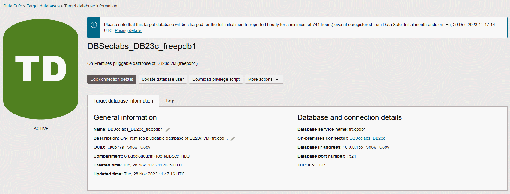
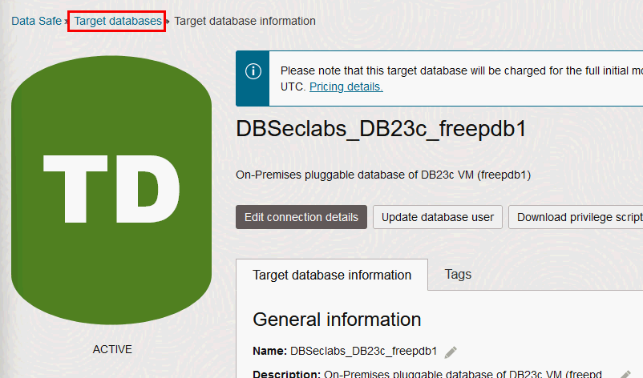
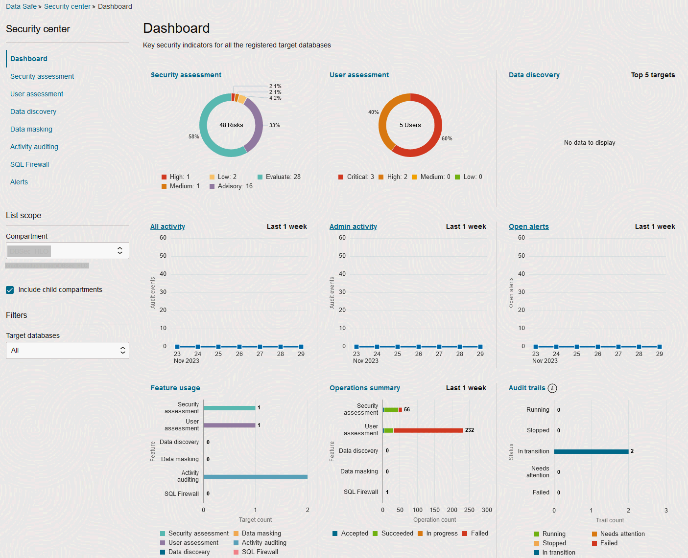
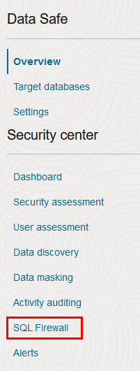

# Oracle SQL Firewall

## Introduction
This workshop introduces the functionality of Oracle SQL Firewall. It gives the user an opportunity to learn how to configure those features to protect against risks targeting security flaws/vulnerabilities in data-driven web applications, including SQL Injection database attacks.

*Estimated Lab Time:* 30 minutes

*Version tested in this lab:* Oracle DB 23.2

### Video Preview
Watch a preview of "*Using SQL Firewall with Oracle Database 23c Free (June 2023)*" [](youtube:7yJv92FvLp4)

### Objectives
- Create a SQL Firewall policy to protect sensitive data
- Detect an insider threat of stolen credential access
- Mitigate the risk of SQL Injection attacks

### Prerequisites
This lab assumes you have:
- A Free Tier, Paid or LiveLabs Oracle Cloud account
- You have completed:
    - Lab: Prepare Setup (*Free-tier* and *Paid Tenants* only)
    - Lab: Environment Setup
    - Lab: Initialize Environment

### Lab Timing (estimated)
| Step No. | Feature | Approx. Time |
|--|------------------------------------------------------------|-------------|
| 1 | Enable SQL Firewall to protect Glassfish HR Application | 10 minutes |
| 2 | Detect an insider threat of stolen credential access with SQL Firewall | 10 minutes |
| 3 | Enforce allowed SQL and access patterns with SQL Firewall, mitigating the risk of SQL Injection attacks | 10 minutes |
| 4 | Reset the SQL Firewall Labs Environment | <5 minutes |

## Task 1: Enable SQL Firewall to protect Glassfish HR Application

??????????

## Task 1a: Setup SQL Firewall env

In this lab you will modify the Glassfish connection (instead of connecting directly to the 19c pluggable database pdb1, Glassfish will connect to an Oracle Database 23c so we can monitor, and block, SQL commands)

1. Open a Terminal session on your **DBSec-Lab** VM as OS user *oracle*

    ````
    <copy>sudo su - oracle</copy>
    ````

    **Note**: If you are using a remote desktop session, double-click on the *Terminal* icon on the desktop to launch a session

2. Go to the scripts directory

    ````
    <copy>cd $DBSEC_LABS/sqlfw</copy>
    ````

3. Migrate the Glassfish Application connection string in order to target the 23c database

    ````
    <copy>./sqlfw_glassfish_start_db23c.sh</copy>
    ````

    

4. Next, verify the application functions as expected

    - Open a Web Browser at the URL *`http://dbsec-lab:8080/hr_prod_pdb1`* to access to **your Glassfish App**

        **Notes:** If you are not using the remote desktop you can also access this page by going to *`http://<YOUR_DBSEC-LAB_VM_PUBLIC_IP>:8080/hr_prod_pdb1`*
    
    - Login to the application as *`hradmin`* with the password "*`Oracle123`*"

        ````
        <copy>hradmin</copy>
        ````

        ````
        <copy>Oracle123</copy>
        ````

        

        

    - In the top right hand corner of the App, click on the **Welcome HR Administrator** link and you will be sent to a page with session data

        

    - On the **Session Details** screen, you will see how the application is connected to the database. This information is taken from the **userenv** namespace by executing the `SYS_CONTEXT` function.

        

    - Now, you should see **FREEPDB1** as the **`DB_NAME`** and **db23c** as the **HOST**

        


5. Create an administrator (**`dba_tom`**) to manage SQL Firewall

    ````
    <copy>./sqlfw_crea_admin-user.sh</copy>
    ````

    

6. Enable SQL Firewall

    ````
    <copy>./sqlfw_enable.sh</copy>
    ````

    

## Task 1b: Enable SQL Firewall to learn authorized SQL traffic of HR Application user

1. Start the SQL workload capture of the application user EMPLOYEESEARCH_PROD

    ````
    <copy>./sqlfw_capture_start.sh</copy>
    ````

    

2. Now, use your Glassfish App to generated activity on your database:

    - Go back to your web browser window to *`http://dbsec-lab:8080/hr_prod_pdb1`*
    
        **Notes:** If you are not using the remote desktop you can also access this page by going to *`http://<YOUR_DBSEC-LAB_VM_PUBLIC_IP>:8080/hr_prod_pdb1`*
    
    - Click on **Search Employees**

        

    - Click [**Search**]

        

    - Change some of the criteria and Search again
    - **Repeat 2-3 times** to ensure you have enough traffic

3. Go back to your terminal session to ensure that the application workload SQL statements and connections are appropriately captured

    ````
    <copy>./sqlfw_capture_check.sh</copy>
    ````

    - Check the session logs
    
        

    - Check the capture logs

        

4. If you are satisfied, stop the SQL workload capture

    ````
    <copy>./sqlfw_capture_stop.sh</copy>
    ````

    

## Task 1c: Generate and enable allow list rules for HR Application user

1. Generate the allow list rule

    ````
    <copy>./sqlfw_allow_list_rule_gen.sh</copy>
    ````

    

2. Compare this list to the events we captured

    ````
    <copy>./sqlfw_capture_count_events.sh</copy>
    ````

    

    **Note:** The count matches the count of distinct events we captured

3. Now, examine the SQL Firewall allow list rules for trusted database connections and SQL statements

    ````
    <copy>./sqlfw_allow_list_rule_exam.sh</copy>
    ````

    

4. Set up the audit policies for SQL Firewall violations

    ````
    <copy>./sqlfw_setup_audit_policies.sh</copy>
    ````

    


5. Enable the allow-list rule for `EMPLOYEESEARCH_PROD` in **observation mode**

    ````
    <copy>./sqlfw_allow_list_rule_enable_monitor.sh</copy>
    ````

    

    **Note:** Here, we will observe and not block SQL Firewall violations

## Task 2: Detect an insider threat of stolen credential access with SQL Firewall

??????????

1. Validate that normal application SQL workload is allowed to the database

    **Note:** Here we run the normal application workload to show that these already allow-listed SQL statements are allowed into the database

2. Use your Glassfish App to generated activity on your database and perform your normal operations (matched, no violation log): 

    - Login to Glassfish application http://130.162.43.32:8080/myhrapp/index.jsp, 

    - Go back to your web browser window to *`http://dbsec-lab:8080/hr_prod_pdb1`*
    
        **Notes:** If you are not using the remote desktop you can also access this page by going to *`http://<YOUR_DBSEC-LAB_VM_PUBLIC_IP>:8080/hr_prod_pdb1`*
    
    - Click on **Search Employees**

        

    - Click [**Search**]

        

    - Change some of the criteria and Search again
    - **Repeat 2-3 times** to ensure you have enough traffic

3. Go back to your terminal session to check violation logs and audit records

    ````
    <copy>./sqlfw_check_events.sh</copy>
    ````

    

    **Note:** No records is found!

4. Now, let's detect an insider threat of stolen credential access
 
     - Here, there is an insider who had access to the stolen credential of HR Apps user `EMPLOYEESEARCH_PROD`, and to bypass the HR application authorization he uses SQL*Plus to gain access to the sensitive employee data

        ````
        <copy>./sqlfw_select_sensitive_data.sh</copy>
        ````

        

    - Check again violation logs and audit records

        ````
        <copy>./sqlfw_check_events.sh</copy>
        ````

        

        **Note:** SQL Firewall context violation is raised since SQL*Plus is not in the allowed OS program allow list, catching attention of security administrators


## Task 3: Enforce allowed SQL and access patterns with SQL Firewall to mitigate the risks of SQL Injection attacks

Here, we will enable the SQL Firewall to block on detection of unauthorized SQL connections / statements

1. Update the allow-list rule enforcement to **blocking mode**

    ````
    <copy>./sqlfw_allow_list_rule_enable_block.sh</copy>
    ````

    

    **Note:** SQL Firewall can now block SQL Injection attempts

2. Now, a hacker logs into Glassfish application to perform a SQL injection attack

    - Go back to your Glassfish App web page, logout and login as *`hradmin`* with the password "*`Oracle123`*"

    - Click **Search Employees**

        

    - Click [**Search**]

        

        **Note**: All rows are returned... normal, because, remerber, you allowed everything!

    - Now, tick the **checkbox "Debug"** to see the SQL query behind this form

        

    - Click [**Search**] again

        

        **Note:**
        - Now, you can see the official SQL query executed by this form which displays the results
        - This query gives you the information of the number of columns requested, their name, their datatype and their relationship

    - Now, based on this information, you can create our "UNION-based" SQL Injection query to display all sensitive data you want extract directly from the form. Here, we will use this query to extract `USER_ID', 'MEMBER_ID', 'PAYMENT_ACCT_NO` and `ROUTING_NUMBER` from `DEMO_HR_SUPPLEMENTAL_DATA` table.

        ````
        <copy>
        ' UNION SELECT userid, ' ID: '|| member_id, 'SQLi', '1', '1', '1', '1', '1', '1', 0, 0, payment_acct_no, routing_number, sysdate, sysdate, '0', 1, '1', '1', 1 FROM demo_hr_supplemental_data --
        </copy>
        ````

    - Copy the SQL Injection query, **paste it directly into the field "Position"** on the Search form and **tick the "Debug" checkbox**

        

        **Note:**
        - Don't forget the "`'`" before the UNION key word to close the SQL clause "LIKE"
        - Don't forget the "`--`" at the end to disable rest of the query

    - Click [**Search**]

        

        **Note:**
        - The output should return an ORA-failures on these attempts
        - Remember, this is because the UNION query has not been added into the Allow-list in the SQL Firewall policy... as simple as that!

3. Now, check violation logs and audit records

    ````
    <copy>./sqlfw_check_events.sh</copy>
    ````

    

    **Note:** SQL Firewall SQL violation is raised, catching attention of security administrators!

## Task 4: Reset the SQL Firewall Labs Environment

1. Once you are comfortable with the SQL Firewall concept, you can reset the environment

    ````
    <copy>./sqlfw_reset_env.sh</copy>
    ````

    

2. Migrate the Glassfish Application connection string in order to target the default database (**pdb1**)

    ````
    <copy>./sqlfw_glassfish_stop_db23c.sh</copy>
    ````

    

You may now proceed to the next lab!

## **Appendix**: About the Product
### **Overview**

??????????

## Want to Learn More?
Technical Documentation:
- [Oracle SQL Firewall 23c](https://docs.oracle.com/en/database/oracle/oracle-database/23/dbseg/using-sql-firewall.html#GUID-F53EAE01-CE78-47F4-80AD-A0091BA3C434)

## Acknowledgements
- **Author** - Hakim Loumi, Database Security PM
- **Contributors** - Angeline Dhanarani
- **Last Updated By/Date** - Hakim Loumi, Database Security PM - September 2023