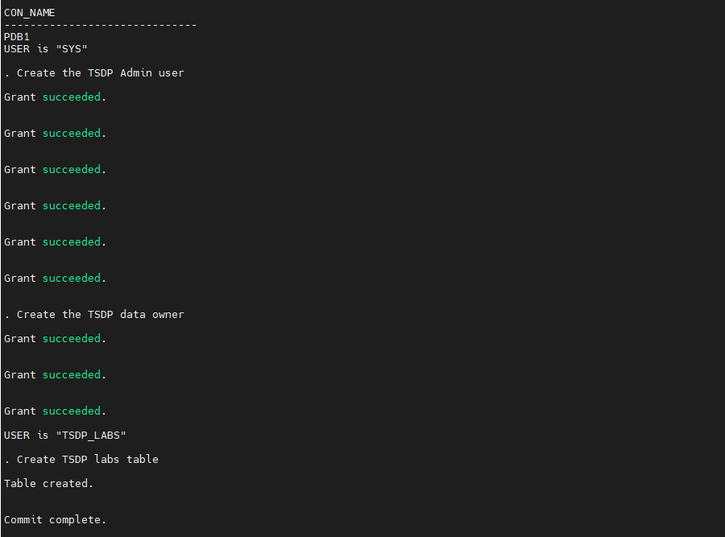
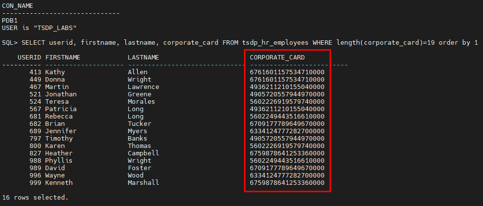
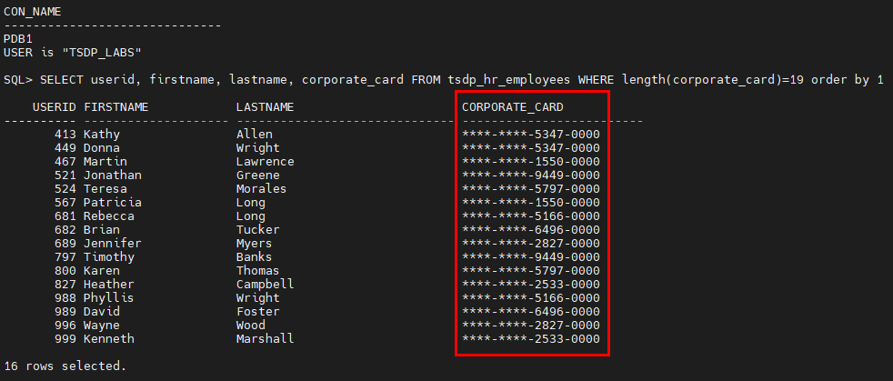
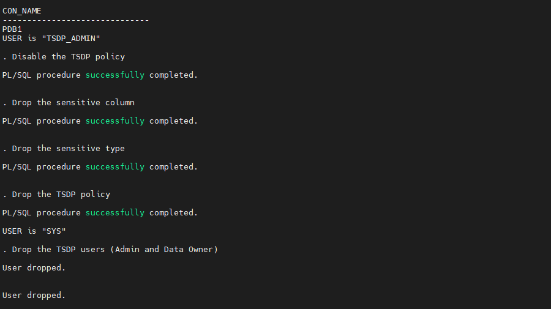

# Oracle Transparent Sensitive Data Protection (TSDP)

## Introduction
This workshop introduces the functionality of Oracle Transparent Sensitive Data Protection (TSDP). It gives the user an opportunity to learn how to configure those features in order to protect access to sensitive data by redacting them on-the-fly.

*Estimated Lab Time:* 15 minutes

*Version tested in this lab:* Oracle DB 19.19

### Video Preview
No video for the moment

### Objectives
- Create a TSDP policy on sensitive data
- Check the dynamic sensitive data redact to prevent its exposure outside the application

### Prerequisites
This lab assumes you have:
- A Free Tier, Paid or LiveLabs Oracle Cloud account
- You have completed:
    - Lab: Prepare Setup (*Free-tier* and *Paid Tenants* only)
    - Lab: Environment Setup
    - Lab: Initialize Environment

### Lab Timing (estimated)
| Step No. | Feature | Approx. Time |
|--|------------------------------------------------------------|-------------|
| 1 | Prepare the TSDP Environment for the Labs | <5 minutes |
| 2 | Create a TSDP Policy | 5 minutes |
| 3 | Reset the TSDP Labs Environment | <5 minutes |

## Task 1: Prepare the TSDP Environment for the Labs

1. Open a Terminal session on your **DBSec-Lab** VM as OS user *oracle*

    ````
    <copy>sudo su - oracle</copy>
    ````

    **Note**: If you are using a remote desktop session, double-click on the *Terminal* icon on the desktop to launch a session

2. Go to the scripts directory

    ````
    <copy>cd $DBSEC_LABS/tsdp</copy>
    ````

3. Create the TSDP **Admin user**, the TSDP **data owner** and create the **TSDP labs table**

    ````
    <copy>./tsdp_prepare_env.sh</copy>
    ````

    

## Task 2: Create a TSDP Policy

1. Create the Sensitive Type "`CREDIT_CARD_TYPE`"

    ````
    <copy>./tsdp_create_sensitive_type.sh</copy>
    ````

    

    **Note:**
    - The sensitive type is a class of data that you designate as sensitive
    - Here, we will create a "`credit_card_type`" sensitive type **for all credit card numbers**

2. Identify the sensitive columns to protect (here, we will use the column "`CORPORATE_CARD`")

    ````
    <copy>./tsdp_add_sensitive_col.sh</copy>
    ````

    

    **Note:** To identify the columns to protect, based on the sensitive type that you defined, you either can use an OEM Cloud Control Application Data Model (ADM) to identify these columns, or you can use the `DBMS_TSDP_MANAGE.ADD_SENSITIVE_COLUMN` procedure

3. Create the TSDP policy "`REDACT_PARTIAL_CC`" based on a **partial redaction** that will replace the first 8 characters by "*"

    ````
    <copy>./tsdp_create_policy.sh</copy>
    ````

    

    **Note:** You can create the policy by defining an anonymous block that has the following components:
    - If you are using Oracle Data Redaction for your policy, a specification of the type of Data Redaction that you want to use, such as partial Data Redaction
    - If you are using Oracle Virtual Private Database for your policy, a specification of the VPD settings that you want to use
    - Conditions to test when the policy is enabled. For example, the data type of the column which should be satisfied before the policy can be enabled
    - A named transparent sensitive data protection policy to tie these components together, by using the `DBMS_TSDP_PROTECT.ADD_POLICY` procedure

4. Associate the TSDP policy "`REDACT_PARTIAL_CC`" with the sensitive type "`CREDIT_CARD_TYPE`" created previously

    ````
    <copy>./tsdp_associate_policy.sh</copy>
    ````

    

5. Select sensitive data **before enabling** the TSDP policy

    ````
    <copy>./tsdp_select_data.sh</copy>
    ````

    

    **Note:** The credit card numbers in the column "`CORPORATE_CARD`" are in clear text

6. Enable the TSDP policy "`REDACT_PARTIAL_CC`"

    ````
    <copy>./tsdp_enable_policy.sh</copy>
    ````

    

7. Select sensitive data **after enabling** the TSDP policy

    ````
    <copy>./tsdp_select_data.sh</copy>
    ````

    

    **Note:**
    - Now, you can see that the credit card numbers have been redacted with the format `****-****-9999-9999`
    - As you can see, TSDP redacts sensitive data **immediately** and you **don't need rebooting or rewriting SQL query**!

## Task 3: Reset the TSDP Labs Environment

1. Once you are comfortable with the TSDP concept, you can reset the environment

    ````
    <copy>./tsdp_reset_env.sh</copy>
    ````

    

You may now proceed to the next lab!

## **Appendix**: About the Product
### **Overview**

Transparent Sensitive Data Protection (TSPD) is a way to find and classify table columns that hold sensitive information.

This feature enables you to quickly find the table columns in a database that hold sensitive data, classify this data, and then create a policy that protects this data as a whole for a given class. Examples of this type of sensitive data are credit card numbers or Social Security numbers.

The TSDP policy then protects the sensitive data in these table columns by using either Oracle Data Redaction or Oracle Virtual Private Database settings. The TSDP policy applies at the column level of the table that you want to protect, targeting a specific column data type, such as all NUMBER data types of columns that contain credit card information. You can create a uniform TSDP policy for all of the data that you classify, and then modify this policy as necessary, as compliance regulations change. Optionally, you can export the TSDP policies for use in other databases.

The benefits of TSDP policies are enormous: You easily can create and apply TSDP policies throughout a large organization with numerous databases. This helps auditors greatly by enabling them to estimate the protection for the data that the TSDP policies target. TSDP is particularly useful for government environments, in which you may have a lot of data with similar security restrictions and you must apply a policy to all of this data consistently. The policy could be to redact it, encrypt it, control access to it, audit access to it, and mask it in the audit trail. Without TSDP, you would have to configure every redaction policy, column-level encryption configuration, and Virtual Private Database policy column by column.

### **Benefits of using Transparent Sensitive Data Protection (TSDP)**
- **You configure the sensitive data protection once, and then deploy this protection as necessary**. You can configure transparent sensitive data protection policies to designate how a class of data (for example, credit card columns) must be protected without actually having to specify the target data. In other words, when you create the transparent sensitive data protection policy, you do not need to include references to the actual target columns that you want to protect. The transparent sensitive data protection policy finds these target columns based on a list of sensitive columns in the database and the policy's associations with the specified sensitive types. This can be useful when you add more sensitive data to your databases after you have created the transparent sensitive data protection policies. After you create the policy, you can enable protection for the sensitive data in a single step (for example, enable protection based on the entire source database). The sensitive type of the new data and the sensitive type and policy associations determine how the sensitive data is protected. In this way, as new sensitive data is added, you do not need to configure its protection, as long as it meets the current transparent sensitive data protection policy's requirements.

- **You can manage protection of multiple sensitive columns**. You can enable or disable protection for multiple sensitive columns based on a suitable attribute (such as the source database of the identification, the sensitive type itself, or a specific schema, table, or column). This granularity provides a high level of control over data security. The design of this feature enables you to manage data security based on specific compliance needs for large data sets that fall under the purview of these compliance regulations. You can configure data security based on a specific category rather than for each individual column. For example, you can configure protection for credit card numbers or Social Security numbers, but you do not need to configure protection for each and every column in the database that contains this data.

- **You can protect the sensitive columns identified using the Oracle Enterprise Manager Cloud Control Application Data Modeling (ADM) feature**. You can use the Cloud Control ADM feature to create sensitive types and discover a list of sensitive columns. Then you can import this list of sensitive columns and their corresponding sensitive types into your database. From there, you can create and manage transparent sensitive data protection policies using this information.

## Want to Learn More?
Technical Documentation:
- [Oracle Transparent Sensitive Data Protection 19c](https://docs.oracle.com/en/database/oracle/oracle-database/19/dbseg/using-transparent-sensitive-data-protection.html)

## Acknowledgements
- **Author** - Hakim Loumi, Database Security PM
- **Contributors** - Pedro Lopes
- **Last Updated By/Date** - Hakim Loumi, Database Security PM - July 2023